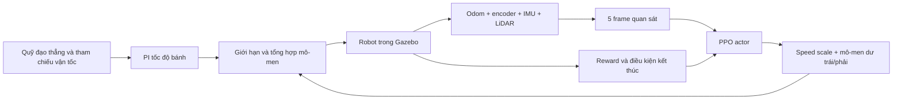

# Nino-RL: điều khiển bám quỹ đạo thẳng bằng PPO dư mô-men trong ROS 2/Gazebo

## Tóm tắt

Dự án này xây dựng bộ điều khiển học tăng cường cho robot di động Nino nhằm đi
từ điểm đầu đến điểm cuối theo một quỹ đạo thẳng, đồng thời hạn chế lệch ngang,
sai số hướng, trượt bánh, rung xóc và sử dụng mô-men quá mức khi vượt qua dây
cáp hoặc địa hình gồ ghề. Robot là nền tảng vi sai có hai bánh chủ động, hai
bánh caster đỡ, encoder, IMU và LiDAR 2D; đây không phải robot hai bánh tự cân
bằng. Hệ thống chạy trên ROS 2 Jazzy và Gazebo Harmonic.

Phương pháp được chọn là **Proximal Policy Optimization (PPO) kết hợp điều
khiển dư**. Bộ điều khiển PI truyền thống vẫn tạo lực tiến cơ bản từ lệnh thẳng
`/cmd_vel`; mạng PPO không thay thế toàn bộ bộ điều khiển mà học ba đại lượng:
hệ số vận tốc, mô-men tiến chung và mô-men quay vi sai. Cách tổ chức này giữ lại
một hành vi nền an toàn, đồng thời cho phép policy học cách sửa hướng và giảm
xóc dựa trên lịch sử cảm biến. Mỗi quan sát gồm năm frame, mỗi frame 60 giá trị,
tạo đầu vào 300 chiều; đầu ra gồm ba action liên tục.

Tài liệu này mô tả **đúng thiết kế và cấu hình hiện tại của mã nguồn**, không
phải tuyên bố rằng policy đã hội tụ hoặc đã tốt hơn baseline. Những kết luận về
hiệu năng phải được xác nhận bằng đánh giá độc lập trên nhiều seed.

## 1. Bài toán và mục tiêu nghiên cứu

Quỹ đạo tham chiếu cố định đi từ

\[
\mathbf p_0=(0,0,0) \quad\text{đến}\quad \mathbf p_g=(6,0,0),
\]

được lấy mẫu cách nhau 0,25 m. Một dây cáp nằm tại \(x=4\) m, vì vậy robot còn
2 m sau chướng ngại để ổn định lại và thể hiện khả năng bám đường. Tốc độ thẳng
danh định là 0,75 m/s; gần đích, tham chiếu giảm trơn xuống tối thiểu 0,03 m/s.
Vận tốc góc của tham chiếu luôn bằng 0 và Nav2 không tham gia thí nghiệm này.

Mục tiêu tối ưu không chỉ là “đến đích”, mà gồm bốn nhóm:

1. hoàn thành hành trình trong giới hạn 20 s, hướng tới mốc 15 s;
2. bám sát tâm quỹ đạo và giữ đúng hướng;
3. vượt gờ với rung xóc, nghiêng thân và trượt bánh nhỏ;
4. tạo action và mô-men trơn, tiết kiệm và không bão hòa.

Vì các mục tiêu có thể xung đột, ví dụ giảm tốc giúp êm hơn nhưng có thể gây
timeout, reward phải ưu tiên tiến độ đúng hướng trước rồi mới tối ưu độ êm và
năng lượng.

## 2. Kiến trúc hệ thống

Một action được giữ trong 0,1 s thời gian mô phỏng. Ở mỗi bước, Gazebo đang
pause sẽ được tiến đúng 50 bước vật lý, mỗi bước 0,002 s, thường chia thành hai
đợt 25 bước để các publisher có cơ hội xử lý. Sau đó môi trường chờ các luồng
odom, ground truth, joint state và phản hồi mô-men mới trước khi tính reward.
PPO cập nhật mạng trong lúc thế giới vẫn pause, nên thời gian tối ưu trên GPU
không làm hao thời hạn của episode.

GPU chỉ huấn luyện mạng neural; vật lý Gazebo và phần lớn ROS vẫn chạy trên
CPU. Đây là một môi trường Gazebo đơn, không phải mô phỏng song song kiểu Isaac
Lab.

## 3. Mô hình bài toán học tăng cường

Hệ được mô hình hóa gần đúng như một quá trình quyết định Markov mở rộng bằng
lịch sử:

\[
(s_t,a_t,r_t,s_{t+1}),
\]

trong đó \(s_t\) là năm quan sát gần nhất, \(a_t\) là lệnh liên tục ba chiều,
\(r_t\) là reward tổng hợp và \(s_{t+1}\) là trạng thái sau 0,1 s mô phỏng.
Việc chồng frame giúp mạng suy ra xu hướng chuyển động và đáp ứng động lực học
mà không cần hidden state hồi quy.

### 3.1. Không gian quan sát

Mỗi frame có 60 giá trị, được chuẩn hóa và clip vào \([-5,5]\). Năm frame từ
cũ đến mới tạo vector đầu vào \(s_t\in\mathbb R^{300}\). Một frame chứa:

- chín điểm look-ahead trong hệ tọa độ robot, tương đương 18 giá trị;
- \(\cos(e_\psi),\sin(e_\psi)\), vận tốc dài và vận tốc quay;
- vận tốc hai bánh;
- quaternion, gyro ba trục và gia tốc ba trục từ IMU;
- năm vùng khoảng cách LiDAR;
- action/mô-men dư trước đó;
- vận tốc tham chiếu, hướng tới điểm look-ahead, sai số ngang, khoảng cách tới
  waypoint và đích, roll, pitch, phần thời gian còn lại và cờ tham chiếu hợp lệ;
- gia tốc thẳng đứng trong hệ world sau khi bù trọng lực;
- bốn giá trị terrain preview tùy chọn.

Terrain preview hiện không bắt buộc và không có producer thực, nên mặc định là
0 với cờ invalid. Policy **không nhận** vận tốc ground-truth của Gazebo, slip
tính từ ground truth hay vị trí dây cáp được sinh tự động. Ground truth chỉ được
dùng khi tính reward slip và các metric trong mô phỏng. Vì actor và critic PPO
dùng cùng kiểu quan sát triển khai được, đây không phải kiến trúc asymmetric
privileged critic.

### 3.2. Không gian hành động và điều khiển dư

Policy sinh vector

\[
\mathbf u_t=[u_s,u_f,u_y],\qquad u_i\in[-1,1].
\]

Hệ số vận tốc được đổi sang miền \([0,1]\):

\[
\alpha_t=\frac{u_s+1}{2}.
\]

Mô-men dư cho hai bánh là

\[
\tau_L=\tau_{\max}\,\operatorname{clip}(u_f-u_y,-1,1),
\]

\[
\tau_R=\tau_{\max}\,\operatorname{clip}(u_f+u_y,-1,1),
\]

với \(\tau_{\max}=2.0\) Nm theo cấu hình hiện tại. Thành phần \(u_f\) tác động
cùng chiều lên hai bánh, còn \(u_y\) tạo chênh lệch trái-phải để sửa hướng.
Mô-men này được cộng vào đầu ra PI rồi đi qua giới hạn an toàn của controller.

Do đó PPO đóng vai trò một bộ bám quỹ đạo học được tương tự chức năng sửa lái
của pure pursuit, nhưng không dùng công thức hình học cố định. Baseline đảm bảo
có tham chiếu tiến thẳng; policy học khi nào nên tăng/giảm tốc và tạo mô-men vi
sai để giữ \(e_y\) và \(e_\psi\) gần 0.

## 4. Mạng policy và value

Policy là Gaussian liên tục của Stable-Baselines3:

\[
a_t\sim\pi_\theta(a_t\mid s_t)
=\mathcal N\!\left(\mu_\theta(s_t),
\operatorname{diag}(\sigma_\theta^2)\right).
\]

Action lấy mẫu được clip về miền hợp lệ trước khi đưa vào môi trường. Kiến trúc
không thêm `tanh` sau phân phối, nhờ đó log-probability dùng trong PPO vẫn nhất
quán.

Với mỗi nhánh actor và critic, bộ trích đặc trưng nhận tensor 5×60 và ghép:

\[
z_t=[x_t,\;x_t-x_{t-1},\;f_{\mathrm{CNN}}(x_{t-4:t})].
\]

Hai lớp Conv1D 32 kênh, kernel 3, activation ELU xử lý thứ tự thời gian; sau đó
lớp fully connected tạo 64 đặc trưng lịch sử. Kết quả gồm 60 giá trị hiện tại,
60 sai phân gần nhất và 64 đặc trưng học được, tổng cộng 184 chiều. Actor và
critic có feature extractor riêng:

- actor MLP: 184 → 128 → 128 → trung bình của 3 action;
- critic MLP: 184 → 256 → 128 → một giá trị \(V_\phi(s_t)\);
- activation: ELU;
- độ lệch chuẩn ban đầu: \(\exp(-1.386294)\approx0.25\);
- trung bình action ban đầu: \([0.4,0,0]\), tương ứng speed scale khoảng 0,70
  và mô-men dư trung bình bằng 0.

Khởi tạo này khiến robot bắt đầu với hành vi gần baseline thay vì action ngẫu
nhiên biên độ lớn, nhưng vẫn có đủ nhiễu Gaussian để khám phá.

## 5. Thuật toán PPO

PPO là thuật toán on-policy: dữ liệu cũ chỉ được dùng cho một đợt cập nhật ngắn
rồi bỏ. Với tỷ số xác suất

\[
\rho_t(\theta)=
\frac{\pi_\theta(a_t\mid s_t)}{\pi_{\theta_{old}}(a_t\mid s_t)},
\]

hàm mục tiêu clipped là

\[
L^{CLIP}(\theta)=\mathbb E_t\left[
\min\left(\rho_t\hat A_t,
\operatorname{clip}(\rho_t,1-\epsilon,1+\epsilon)\hat A_t\right)
\right],
\]

với \(\epsilon=0.2\). Clipping ngăn policy thay đổi quá mạnh sau một batch.
Advantage được ước lượng bằng Generalized Advantage Estimation (GAE):

\[
\delta_t=r_t+\gamma V_\phi(s_{t+1})-V_\phi(s_t),
\]

\[
\hat A_t=\delta_t+\gamma\lambda\hat A_{t+1},
\]

trong đó \(\gamma=0.997\) và \(\lambda=0.95\). Hàm loss tổng quát là

\[
\mathcal L=-L^{CLIP}+c_vL_V-c_e\mathcal H(\pi),
\]

với \(c_v=0.5\), \(c_e=0.001\). Entropy \(\mathcal H\) duy trì khám phá; value
loss dạy critic ước lượng return để giảm phương sai của policy gradient.

Mỗi rollout thu 2.048 bước, sau đó được chia minibatch 256 và học 10 epoch với
learning rate \(3\times10^{-4}\). Gradient norm bị giới hạn ở 0,5; cập nhật có
thể dừng sớm khi KL divergence vượt mục tiêu 0,015. Với tần số 10 Hz, một
rollout tương ứng khoảng 204,8 s mô phỏng, thường chứa nhiều episode.

## 6. Hàm reward đang sử dụng

Đặt

\[
h=\frac{\Delta t}{0.1},\qquad
C(x)=\min(x^2,9),\qquad
K(e,\sigma)=1-\exp\!\left[-\min\left((e/\sigma)^2,81\right)\right].
\]

Gọi \(e_y\) là sai số ngang, \(e_\psi\) là sai số hướng, và
\(\Delta d=d_{t-1}-d_t\) là mức giảm khoảng cách còn lại. Chất lượng bám đường
khi tiến là

\[
q_t=\exp[-(e_y/0.25)^2]\exp[-(e_\psi/0.35)^2].
\]

Tiến đúng hướng nhận \(\Delta d\,q_t\); đi lùi vẫn giữ nguyên \(\Delta d<0\)
để policy không thể né phạt bằng cách cố tình lệch khỏi đường. Reward mỗi bước
là tổng các thành phần sau:

| Thành phần | Công thức đang dùng |
|---|---|
| Tiến độ | \(20\,\Delta d_{credit}\) |
| Lệch ngang | \(-4h\,C(e_y/0.10)\) |
| Sai hướng | \(-2h\,C(e_\psi/0.174533)\) |
| Va đập/rung dọc | \(-0.05\,k_{impact}\int\min[(|a_z|/2)^4,81]dt/0.1\) |
| Tốc độ quay thân | \(-0.05h[C(\omega_x)+C(\omega_y)]\) |
| Tư thế | phạt roll vượt 0,20 rad và pitch vượt 0,30 rad |
| Trượt bánh | \(-0.1h[C(s_L/0.30)+C(s_R/0.30)]\) |
| Độ trơn action | \(-0.02\|a_t-a_{t-1}\|_2^2/h\) |
| Bão hòa mô-men | phạt khi mô-men đo được vượt 90% thang 5 Nm |
| Mô-men tổng | \(-0.04h\,\operatorname{mean}[(\tau_{applied}/5)^2]\) |
| Mô-men dư | \(-0.005h\,\operatorname{mean}[(\tau_{res}/\tau_{max})^2]\) |
| Tốc độ đổi mô-men | \(-0.02\,\operatorname{mean}[((\tau_t-\tau_{t-1})/5)^2]/h\) |
| Bám vận tốc | \(-h\,w_v K(v-v_{ref},1.2)\), \(w_v=0.1\) khi thiếu tốc và 0.4 khi quá tốc |
| Bám yaw rate | \(-0.15hK(\dot\psi-\dot\psi_{ref},0.5)\) |
| Phanh gần đích | phạt vận tốc dài và yaw rate, nhân cổng \(\exp[-(d_g/0.8)^2]\) |
| Thời gian | \(-0.01h\) |
| Kẹt | \(-0.5h\) nếu tiến dưới 5 cm trong 3 s khi vẫn được lệnh đi tới |

Tỷ số trượt được tính cho từng bánh bằng

\[
s_i=\operatorname{clip}\left(
\frac{r\omega_i-v_{g,i}}
{\max(|r\omega_i|,|v_{g,i}|,0.1)},-5,5\right),
\]

với bán kính bánh 0,0625 m và khoảng cách hai bánh 0,34273666 m. Đây là tín
hiệu đặc quyền chỉ phục vụ reward/đánh giá trong mô phỏng, không đi vào actor.

### 6.1. Reward kết thúc episode

- thành công: +100;
- rollover, collision, sai hướng hoặc navigation invalid: −100;
- ra khỏi đường: −75;
- timeout: \(-50(1-c)\), với \(c\in[0,1]\) là tỷ lệ hoàn thành;
- khi thành công, tiếp tục trừ
  \(-30K(d_g,0.25)-20K(e_\psi,0.20944)\).

Nhờ vậy một lần đến đích luôn nhận bonus thành công, nhưng vị trí và hướng cuối
càng chính xác thì return càng cao. Robot chỉ thành công khi tâm robot nằm trong
vòng tròn bán kính 0,10 m quanh endpoint và sai số hướng không quá 12°. Việc chỉ
cắt qua mặt phẳng đích không còn được tính thành công, nên overshoot và lệch
ngang không thể nhận nhầm bonus. Các failure an toàn vẫn có độ ưu tiên cao hơn
success.

Hệ số impact là

\[
k_{impact}=\min(1,0.25+\ell),
\]

với \(\ell=(phase-1)/5\). Vì vậy phase 1 dùng 25% trọng số impact và phase 6
dùng đủ trọng số. Reward không có bonus sống sót dương; đứng yên không phải
chiến lược có lợi vì chịu phạt thời gian, kẹt và timeout.

## 7. Policy học và thích nghi như thế nào?

Quá trình học lặp lại theo chu trình:

1. actor nhận năm frame cảm biến và lấy mẫu action từ phân phối Gaussian;
2. action điều chỉnh tốc độ và mô-men hai bánh trong 0,1 s mô phỏng;
3. môi trường đo tiến độ, sai số quỹ đạo, IMU, slip và mô-men;
4. reward cao hơn cho chuyển động tiến thẳng, chính xác, êm và ít tốn lực;
5. critic học dự đoán tổng reward tương lai;
6. PPO tăng xác suất của action có advantage dương và giảm xác suất của action
   có advantage âm, nhưng giới hạn độ lớn cập nhật bằng clipping và target KL;
7. sau mỗi rollout, policy mới lại thu dữ liệu mới. Quá trình lặp cho đến hết số
   timestep hoặc khi người vận hành dừng.

Policy không được viết sẵn quy tắc “gặp cáp thì làm gì”. Nó dần liên kết mẫu
history của odom, bánh xe và IMU với hậu quả reward. Ví dụ, action giúp xe vượt
cáp mà vẫn giữ sai số ngang nhỏ và gia tốc dọc thấp sẽ có advantage tốt hơn;
action gây xoay thân, trượt hoặc dùng mô-men giật sẽ bị giảm xác suất. History
encoder cho phép nhận biết xu hướng như bánh đang chậm lại hoặc thân vừa chịu
xung lực, dù một frame đơn không mô tả đầy đủ động lực học.

### 7.1. Cơ chế tăng/đổi độ khó hiện tại

Dự án dùng hai cơ chế khác nhau và cần phân biệt rõ:

**Curriculum dây cáp theo phase là thủ công và sắp từ khó đến dễ.** Cấu hình
hiện có `fixed_phase: 1`; lệnh `--phase N` ghi đè phase cho cả run. Vì vậy các
mốc `phase_fractions` không tự đổi phase trong run hiện tại. Sau khi đánh giá
held-out đạt yêu cầu, nhóm mới resume checkpoint ở phase kế tiếp.

| Phase | Mức | Đường kính cáp | Góc tuyệt đối |
|---:|---|---:|---:|
| 1 | khó nhất | 15 mm | 45° |
| 2 | rất khó | 13 mm | 36° |
| 3 | khó | 11 mm | 27° |
| 4 | trung bình | 9 mm | 18° |
| 5 | dễ | 7 mm | 9° |
| 6 | dễ nhất | 5 mm | 0° |

Dấu của góc khác 0 được chọn ngẫu nhiên mỗi episode để tránh policy thiên về
bánh trái hoặc bánh phải. Thứ tự này là **hard-to-easy**, không phải curriculum
easy-to-hard thông thường. Nếu bỏ `fixed_phase`, code có thể tự chọn phase theo
tỷ lệ tổng bước `[0; 0,15; 0,30; 0,50; 0,70; 0,85]`, nhưng đó không phải chế độ
đang dùng.

**Adaptive terrain tăng độ phức tạp sau thành công.** Ban đầu có 0 feature phụ.
Sau mỗi episode thành công, môi trường thêm một feature, tối đa 20, luân phiên
giữa pothole, obstacle và cable ngắn trong vùng \(x=1,2\ldots5,2\) m. Thứ tự
loại, tọa độ dọc và độ lệch ngang được lấy mẫu lại mỗi episode theo seed; tâm
feature cách đường chuẩn không quá 0,10 m. Vì vậy đường đi thẳng giao với các
hazard và policy phải học phản ứng/né tránh. Khi đánh giá, số feature được đóng
băng ở 20 nhưng layout vẫn được random hóa theo seed để so sánh công bằng.

Domain randomization hiện **tắt**. Nếu bật có chủ đích, nó mới thêm thay đổi ở
kênh residual và cảm biến như delay, torque noise, traction scale, nhiễu/bias
vị trí-hướng và dropout. Nó không thay đổi thật sự khối lượng hay hệ số ma sát
contact của Gazebo, nên không nên gọi là physical domain randomization đầy đủ.

## 8. Điều kiện kết thúc và an toàn

Episode kết thúc khi đạt một trong các điều kiện:

- success: vào vòng tròn bán kính 0,10 m và sai số hướng không quá 12°;
- timeout: 20 s mô phỏng;
- rollover: |roll| hoặc |pitch| ≥ 35°;
- collision theo LiDAR: khoảng hở hiệu chỉnh ≤ 0,10 m;
- off-path: |sai số ngang| ≥ 1,0 m liên tục 1 s;
- wrong direction: sai hướng ≥ 90° hoặc lùi ≤ −0,10 m/s, sau 3 s grace và kéo
  dài 1 s;
- navigation invalid liên tục 2 s.

LiDAR GPU dùng QoS BEST_EFFORT và có thể trễ. Một scan bị mất không trực tiếp
làm dừng train; policy tạm nhận vùng trống/không biết, còn collision chỉ dùng
scan đủ fresh với bù trễ có giới hạn. Các luồng bắt buộc khác vẫn phải mới để
reward không được tính từ trạng thái cũ.

Trước khi học, chương trình chạy preflight 12 điểm: kiểm tra robot, controller,
hai bánh, IMU, joint state, odom, LiDAR, TF, start/goal, tham chiếu thẳng, giao
diện residual và lockstep. ROS domain 77 cùng discovery localhost cô lập world
khỏi `/clock` của simulator hoặc máy khác.

## 9. Checkpoint và tiếp tục huấn luyện

Checkpoint lưu trọng số actor/critic, optimizer và `num_timesteps`. Khi resume,
`--timesteps` là **số bước học thêm**, không phải tổng đích tuyệt đối. Ví dụ
checkpoint đã học 75.000 bước và chạy với `--timesteps 425000` sẽ hướng tới
khoảng 500.000 bước tổng, có thể vượt nhẹ vì PPO hoàn thành rollout 2.048 bước.

Rollout đang thu dở tại thời điểm lỗi hoặc Ctrl-C không được lưu; thông báo
“unfinished rollout is discarded on resume” là hành vi đúng của PPO on-policy,
không có nghĩa là toàn bộ policy đã mất. Chỉ nên resume checkpoint có training
contract tương thích và dùng YAML được lưu cùng run. Contract hiện tại là
revision 22; do điều kiện đích và phân bố hazard đã đổi, checkpoint cũ không
được resume để tránh trộn hai bài toán huấn luyện khác nhau.

## 10. Thiết kế đánh giá

Không chọn model chỉ theo episode return hoặc path RMSE. Một robot đứng yên có
thể có RMSE thấp nhưng completion bằng 0. Quy trình đánh giá nên:

1. chạy baseline và PPO tuần tự trong cùng simulator;
2. dùng cùng phase, config, số episode và seed;
3. ưu tiên tỷ lệ success, sau đó mới xét độ chính xác, độ êm và thời gian;
4. dùng seed phát triển để chọn checkpoint và seed mới cho báo cáo cuối;
5. báo cáo cả trung bình và phân bố, không chỉ episode tốt nhất.

Các metric hiện được xuất gồm success, completion, thời gian, endpoint error,
path/cross-track RMSE, P95 và max error, heading RMSE, backtracking, tilt, slip,
mô-men, gia tốc đứng đỉnh/RMS và số feature adaptive. Mỗi episode có CSV quỹ
đạo và hình chồng quỹ đạo thực với đường tham chiếu. TensorBoard ghi các nhóm
`episode/*`, `reward_terms/*`, `rollout/*` và `train/*` sau khi có đủ dữ liệu.

Một cổng đánh giá ban đầu hợp lý là ít nhất 19/20 success trên held-out seed,
không rollover/collision, P95 sai số đường trong giới hạn đã thống nhất, và độ
êm không tệ hơn baseline. Đây là **tiêu chí đề xuất**, chưa phải kết quả đo.

## 11. Giới hạn và hướng phát triển

- Policy mới được xác thực trong mô phỏng; chưa thể suy ra khả năng sim-to-real.
- LiDAR 2D ngang không đảm bảo nhìn thấy dây cáp thấp từ xa, nên hành vi hiện
  thiên về phản ứng từ history/IMU hơn là chủ động dự báo địa hình.
- Slip reward dựa vào ground truth chỉ tồn tại trong mô phỏng; actor không phụ
  thuộc tín hiệu này, nhưng reward cần được thiết kế lại hoặc ước lượng khi fine
  tune trên robot thật.
- Adaptive feature là hazard runtime xấp xỉ (pothole dùng vành gồ trên sàn phẳng,
  không phải phép trừ mesh tạo hố thật), nên vẫn cần kiểm chứng thêm bằng terrain
  mesh và nhiều seed trước khi suy luận sang robot thật.
- Domain randomization chưa mô hình hóa thay đổi vật lý đầy đủ như ma sát, tải,
  khối lượng, bán kính bánh hoặc sai số actuator.
- PPO on-policy tốn mẫu; huấn luyện một world Gazebo không tận dụng được mô phỏng
  song song dù mạng chạy trên CUDA.

Các bước tiếp theo nên là đánh giá nhiều seed, chọn checkpoint tốt nhất thay vì
mặc định checkpoint cuối, kiểm tra ablation từng nhóm reward, bổ sung terrain
preview từ cảm biến có thể triển khai thật, rồi mới thử sim-to-real với giới hạn
mô-men/tốc độ bảo thủ và nút dừng khẩn cấp.

## 12. Cấu hình tái lập chính

| Hạng mục | Giá trị |
|---|---:|
| Thuật toán | PPO, continuous Gaussian actor-critic |
| Seed mặc định | 42 |
| Tần số điều khiển | 10 Hz |
| Bước vật lý Gazebo | 0,002 s |
| Chiều quan sát | 5×60 = 300 |
| Chiều action | 3 |
| Rollout | 2.048 bước |
| Minibatch | 256 |
| Epoch mỗi rollout | 10 |
| Learning rate | 3×10⁻⁴ |
| \(\gamma\), GAE \(\lambda\) | 0,997; 0,95 |
| PPO clip | 0,2 |
| Entropy coefficient | 0,001 |
| Value coefficient | 0,5 |
| Max gradient norm | 0,5 |
| Target KL | 0,015 |
| Episode tối đa / mục tiêu | 20 s / 15 s |
| Quãng đường | 6 m |
| Tốc độ danh định | 0,75 m/s |
| Goal tolerance | 0,003 m |

Nguồn sự thật cho tài liệu này là
[`ppo.yaml`](../src/nino_rl/config/ppo.yaml),
[`control_v2.py`](../src/nino_rl/nino_rl/control_v2.py),
[`policies.py`](../src/nino_rl/nino_rl/policies.py),
[`ros_env.py`](../src/nino_rl/nino_rl/ros_env.py) và
[`train.py`](../src/nino_rl/nino_rl/train.py). Khi các tệp đó thay đổi, công
thức và thông số trong bài này cũng cần được cập nhật.
